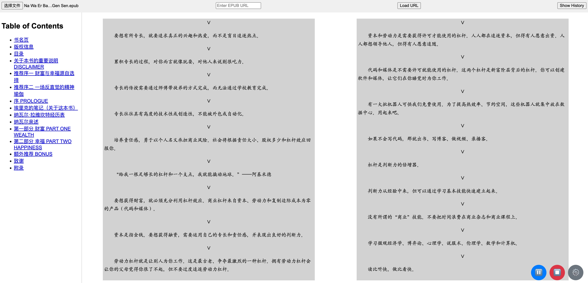

# 项目简介

`Epub Local Reciter` 是一个基于浏览器的 EPUB 电子书阅读器，集成了文本到语音（Text-to-Speech, TTS）功能。该项目允许用户加载本地 EPUB 文件或通过 URL 加载在线 EPUB 文件，并通过集成的 TTS 功能朗读书籍内容，为用户提供便利的听书体验。


## 项目特点

- **本地与在线支持**：用户可以选择上传本地 EPUB 文件，或通过输入在线链接来加载电子书。
- **文本到语音功能**：集成的 TTS 功能，支持朗读当前页面内容，并且用户可以控制播放、暂停、停止朗读，还可以调整语音速度、音量等参数。
- **语音设置自定义**：用户可以选择不同的语音、调整朗读速度和音量，个性化听书体验。
- **历史记录**：保存已加载过的 URL，方便用户快速重新访问。

## 适用场景

- **学习与阅读**：对于不便于长时间盯着屏幕阅读的用户，可以使用 TTS 功能，将电子书转换为音频，方便用户在通勤、运动等场合聆听内容。
- **语言学习**：通过调整朗读速度和选择不同的语音，帮助学习者更好地理解和模仿外语发音。
- **辅助功能**：为有阅读障碍的用户提供便利，使他们可以通过听书获取知识。

## 安装指南

### 先决条件

- 现代浏览器（推荐使用最新版本的 Chrome、Firefox 或 Edge）

### 使用步骤

1. **克隆或下载项目**：
   ```bash
   git clone https://github.com/winglight/epub-local-reciter.git
   cd epub-local-reciter
   ```
2.	打开项目：
	*	直接在浏览器中打开 novel.html 文件。
3.	加载 EPUB 文件：
	*	点击页面上的“上传文件”按钮选择本地 EPUB 文件，或在文本框中输入 EPUB 文件的在线链接并点击“加载 URL”按钮。
4.	使用文本到语音功能：
	*	通过页面右下角的浮动按钮，控制 TTS 功能的播放、暂停和停止。
	*	打开设置面板，自定义语音、朗读速度和音量。

贡献指南

欢迎对本项目进行贡献！请先 fork 仓库，然后提交 pull request。对于重大更改，请先开启 issue 讨论您的修改内容。

许可证

该项目采用 MIT 许可证。详细信息请参阅 LICENSE 文件。